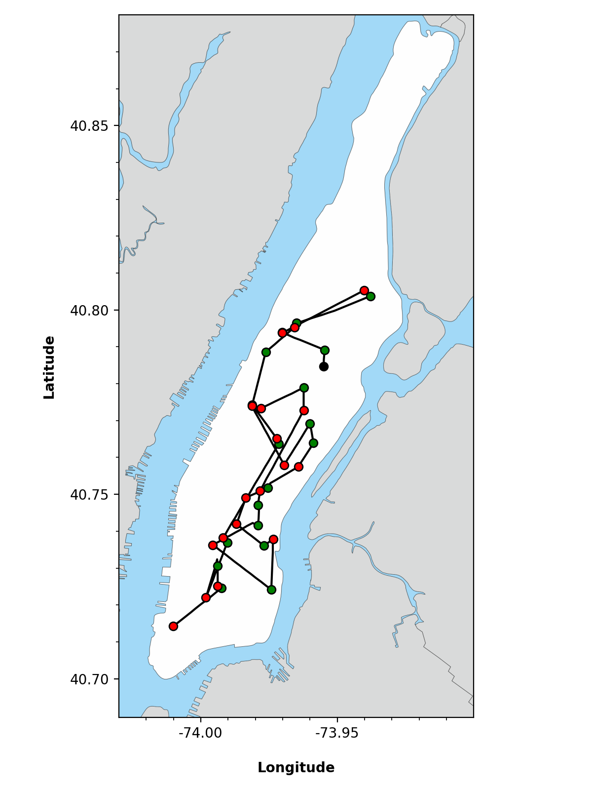

# Taxisim

New York taxi simulator with Q-learning.

* Requires Python >= 3.6.
* Run using PyPy for a welcome 10x speed boost.
* Scripts in `scripts` should be run from the project's root directory.

    

This simulator uses reinforcement learning to optimise the size of individual vehicles in a (hypothetical) fleet of autonomous taxis roaming the streets of Manhattan.
